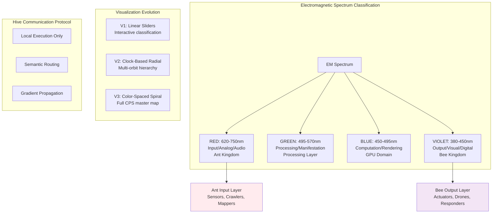
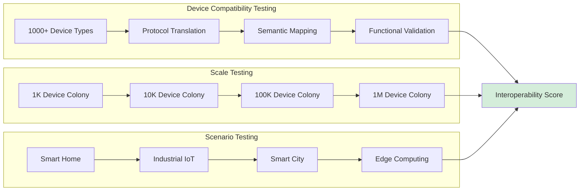
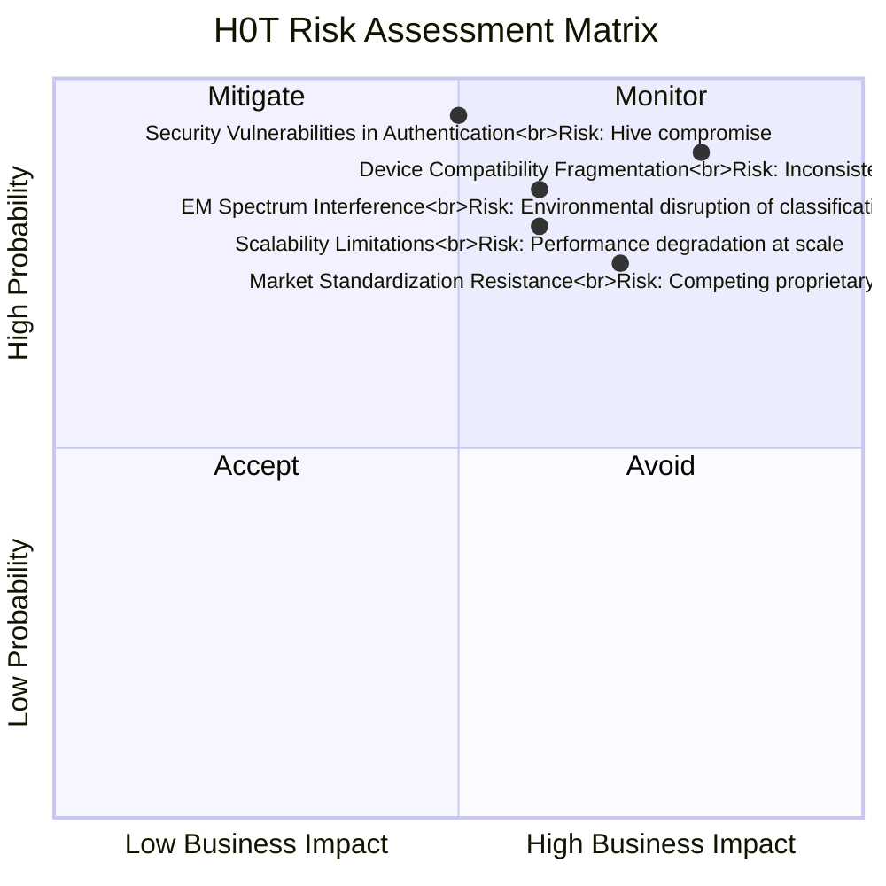
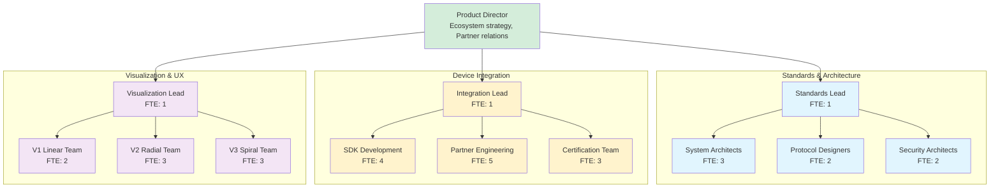

# QUALITY PLAN: LX40 - H0T (HIVE OF THINGS)

## 1. EXECUTIVE SUMMARY

### 1.1 Product Vision & Business Case

  - H0T (Hive of Things) represents the next evolutionary leap beyond traditional IoT, transforming disconnected smart devices into a semantically-aware, consciousness-adjacent superorganism. By replacing protocol-based IoT communication with a Color Positioning System (CPS) and hive intelligence, H0T enables devices to understand their functional roles, coordinate autonomously, and form emergent intelligence. This paradigm shift moves computing from centralized cloud control to distributed, self-organizing edge intelligence.

  - Market Disruption: Targets the $1T+ global IoT market with a complete ecosystem replacement strategy. Addresses critical failures in current IoT systems: security vulnerabilities, interoperability challenges, cloud dependency, and limited intelligence. Serves smart cities (38% market), industrial IoT (28%), smart homes (20%), and edge computing (14%) with a unified semantic framework.

### 1.2 Quality Objectives

  - Interoperability: 100% semantic compatibility across 1000+ device types using CPS classification
  
  - Performance: ≤10ms device discovery and coordination within local hive
  
  - Security: Zero-trust architecture with 4x2 consciousness authentication (biological+psychological+behavioral+soul print)
  
  - Scalability: Support for 1M+ device colonies with emergent coordination
  
  - Reliability: 99.999% hive availability with autonomous healing and reorganization

## 2. PRODUCT ARCHITECTURE & FEATURES

### 2.1 Color Positioning System (CPS) Architecture



### 2.2 Key Features & Capabilities

Feature Category	Specific Features	Technical Implementation
Semantic Classification	EM spectrum mapping, Functional pixel representation, Gradient propagation	Color+icon = functional pixel, RGB encoding of capabilities
Hive Intelligence	Local execution coordination, Emergent behavior, Collective learning	Device dictionaries, Local translation tables, Swarm algorithms
Visualization System	V1 Linear, V2 Radial, V3 Spiral visualization, Real-time state mapping	MUI TimePicker, React-Three-Fiber, Canvas rendering, WebGL acceleration
Security Framework	4x2 consciousness authentication, Zero-trust local mesh, Quantum-resistant encryption	Biometric+behavioral profiling, Local key exchange, Post-quantum cryptography
Orchestration Engine	Device discovery, Role assignment, Workload distribution, Failure recovery	Gossip protocols, Consensus algorithms, Load balancing, Self-healing

## 2.3 Two-Kingdom Architecture

H0T implements a biological-inspired two-kingdom model for complete computational ecosystems:

### Ant Kingdom (Input/Sensors - RED Spectrum):

  - Role: Ground-truth mapping, environmental sensing, data foraging
  
  - Characteristics: High concurrency, low bandwidth, persistence, exploration
  
  - Devices: Sensors, cameras, microphones, environmental monitors, scanners
  
  - Behavior: Pheromone-based signaling, mesh networking, data aggregation

### Bee Kingdom (Output/Actuators - VIOLET Spectrum):

  - Role: Action execution, task completion, result delivery, response
  
  - Characteristics: High bandwidth, rapid response, precision, delivery
  
  - Devices: Actuators, displays, speakers, robots, drones, printers
  
  - Behavior: Vector-based navigation, dance language communication, coordinated action

### The Hive Superorganism:

```text
ANT INPUT → COLONY PROCESSING → BEE OUTPUT
    ↓              ↓                ↓
Sensing       Understanding      Action
Raw Data      Context            Result
Environment   Intelligence       Impact
```

## 3. QUALITY ASSURANCE FRAMEWORK

### 3.1 Interoperability Testing Matrix



### 3.2 Quality Metrics & KPIs

Metric Category	Specific Metric	Target Value	Measurement Method
Interoperability	Device Compatibility Rate	100%	Test matrix covering 1000+ device types
Performance	Discovery & Coordination Time	≤10ms	High-precision timing from query to response
Security	Authentication Success Rate	99.999%	Statistical analysis across 1M+ authentications
Reliability	Hive Uptime	99.999%	Continuous monitoring of colony availability
Scalability	Maximum Colony Size	1M+ devices	Stress testing with simulated device loads

### 3.3 Risk Management Matrix



## 4. DEVELOPMENT & DELIVERY PLAN

### 4.1 Three-Phase Development Roadmap

Phase	Duration	Focus Areas	Key Deliverables
Specification	Q4 2025-Q2 2026	CPS standard, Protocol definition, Security framework	CPS v1.0, Hive Protocol, Authentication system
Implementation	Q3 2026-Q1 2027	V1-V3 visualization, Device SDK, Partner integration	Visualization suite, SDK v1.0, 50+ partner devices
Deployment	Q2 2027-Q4 2027	Certification, Global rollout, Ecosystem growth	Certification program, Global deployment, 1000+ devices

### 4.2 Team Structure & Responsibilities



## 5. COMPLIANCE & CERTIFICATION

### 5.1 Required Certifications

  - FCC Part 15 - Radio frequency device compliance (USA)
  
  - CE RED - Radio Equipment Directive (Europe)
  
  - UL/IEC 62368-1 - Audio/video and ICT equipment safety
  
  - ISO/IEC 27001 - Information security management
  
  - GDPR/CCPA Compliance - Data protection and privacy
  
  - Industry-Specific Certifications - Healthcare (FDA), Industrial (IEC 62443)

### 5.2 Security Framework
  - 4x2 Consciousness Authentication: Combines biological, psychological, behavioral, and soul print factors
  
  - Zero-Trust Local Mesh: Devices only communicate with authenticated neighbors
  
  - Quantum-Resistant Cryptography: Post-quantum algorithms for long-term security
  
  - Behavioral Anomaly Detection: Machine learning detection of compromised devices
  
  - Autonomous Threat Response: Hive-wide response to security incidents

## 6. SUPPORT & MAINTENANCE

### 6.1 Ecosystem Support Structure

  - Device Manufacturers: Certification support, integration assistance, testing services
  
  - Developers: SDK documentation, sample code, development tools, community support
  
  - Enterprise Customers: Deployment assistance, integration services, custom development
  
  - End Users: Automated diagnostics, self-healing, community support forums

### 6.2 Update & Evolution Model
  
  - Continuous: Security patches and critical updates (automated deployment)
  
  - Monthly: Protocol improvements and performance enhancements
  
  - Quarterly: New device support and feature additions
  
  - Annually: Major specification updates and architectural evolution
  
  - Ecosystem-Driven: Updates based on collective learning from all hives
