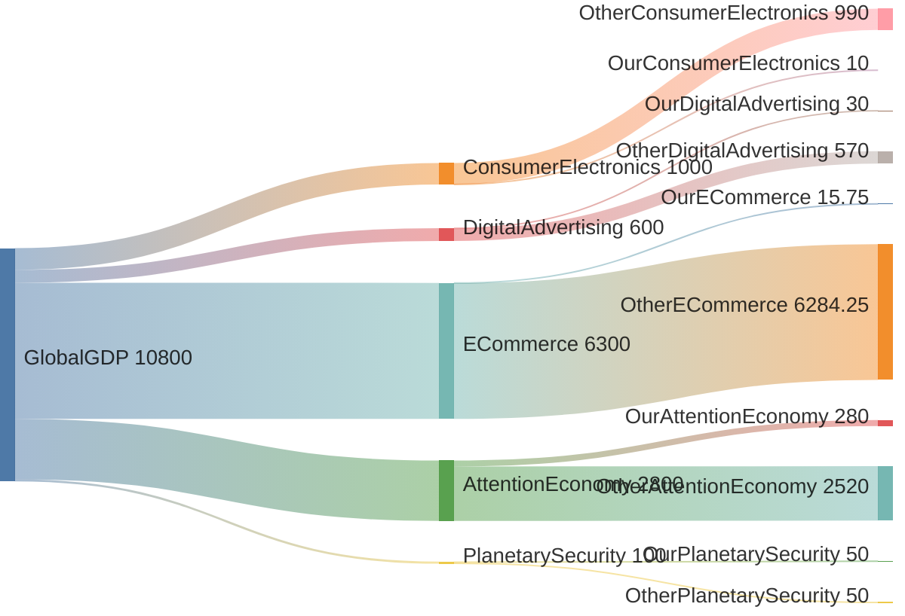

# 6. Market

Let's outline the major market segments from the provided material:

Global GDP (source) - we are told that the global GDP is about $100 trillion.

Consumer Electronics Market - including devices (smartphones, tablets, laptops, etc.) which is a subset of global GDP.

Digital Advertising Market - which is a subset of the global economy and also related to consumer electronics (since ads are displayed on devices).

E-commerce Market - also a subset of global GDP.

Attention Economy - a new market that we are defining, which is a subset of the time spent on devices (and thus related to consumer electronics and digital advertising).

Global GDP: $100 trillion (approximately)

Our target markets (from the "95. Matter" document):

Consumer Electronics (upgrades): $1.00 trillion (1% of which is $10 billion)

Digital Advertising: $600 billion (5% of which is $30 billion)

E-commerce: $6.3 trillion (0.25% of which is $15.75 billion)

Attention Economy: $2.8 trillion (10% of which is $280 billion)

However, note that the Attention Economy is a broader concept that includes the value of human attention. We are also considering the Planetary Security market ($100 billion, 50% of which is $50 billion).

Source: Global GDP ($100 trillion)

Then, the Global GDP splits into:

Consumer Electronics Market ($1.00 trillion)

Digital Advertising Market ($0.60 trillion)

E-commerce Market ($6.30 trillion)

Attention Economy ($2.80 trillion) [Note: This might be overlapping with the above, but for simplicity, we treat it as a separate market for now]

Other GDP (the rest of the GDP not in these markets)

Then, from each of these markets, we take our target percentage and flow to our revenue.

However, note that the Attention Economy is not a traditional market segment but one we are defining. It might be more accurate to show that the Attention Economy is a subset of the time spent on consumer electronics and digital advertising.


```mermaid
sankey-beta  
GlobalGDP[$100T Global GDP] {
    OtherGDP[$88.92T Other GDP]
    
  ConsumerElectronics[$1T Consumer Electronics] {
    OtherConsumerElectronics[$990B Other Consumer Electronics]
    OurConsumerElectronics[$10B Our Share (1%)]
    }
    
    DigitalAdvertising[$600B Digital Advertising] {
      OtherDigitalAdvertising[$570B Other Digital Advertising]
      OurDigitalAdvertising[$30B Our Share (5%)]
    }
    
    ECommerce[$6.3T E-commerce] {
      OtherECommerce[$6.284T Other E-commerce]
      OurECommerce[$15.8B Our Share (0.25%)]
    }
    
    AttentionEconomy[$2.8T Attention Economy] {
      OtherAttentionEconomy[$2.52T Other Attention Economy]
      OurAttentionEconomy[$280B Our Share (10%)]
    }
    
    PlanetarySecurity[$100B Planetary Security] {
      OtherPlanetarySecurity[$50B Other Security]
      OurPlanetarySecurity[$50B Our Share (50%)]
    }
  }
```



